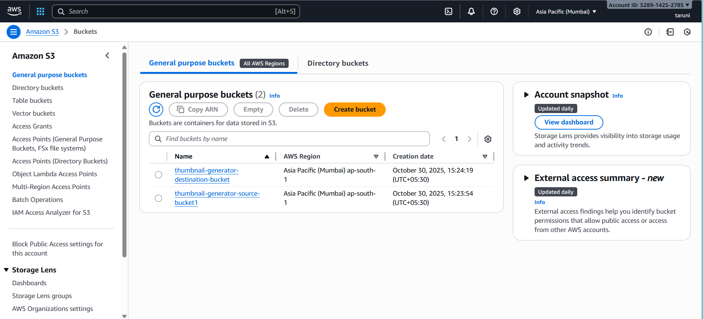
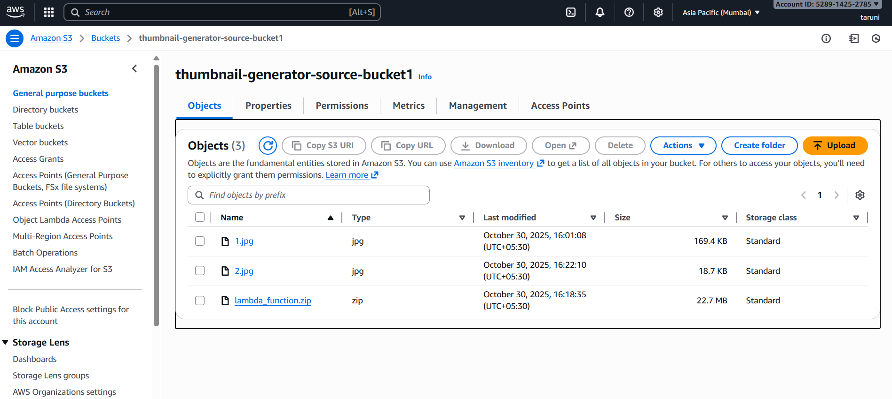
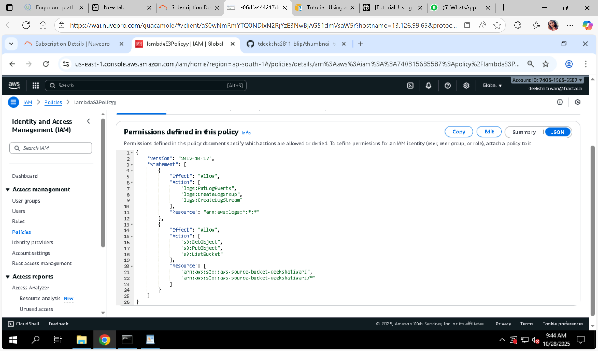
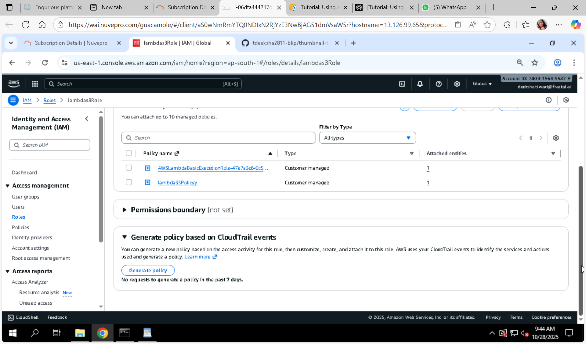
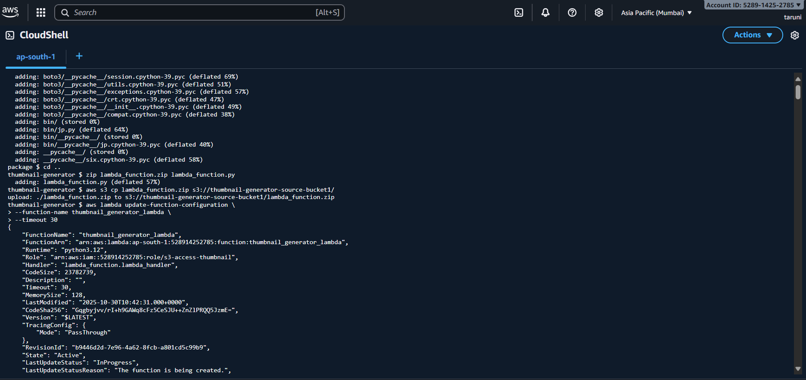
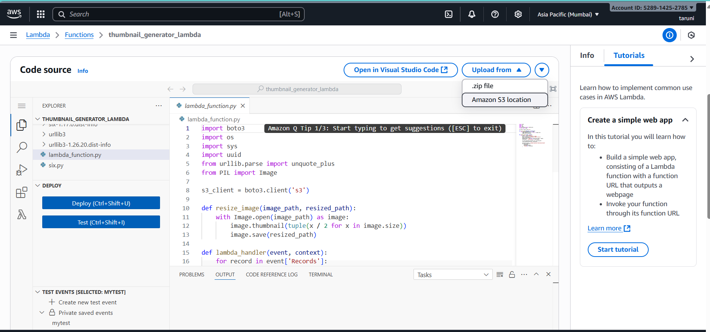
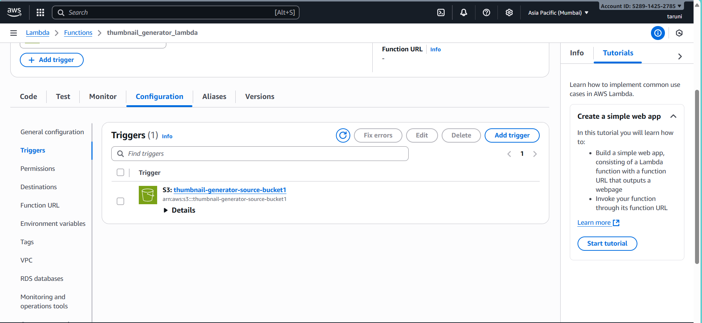
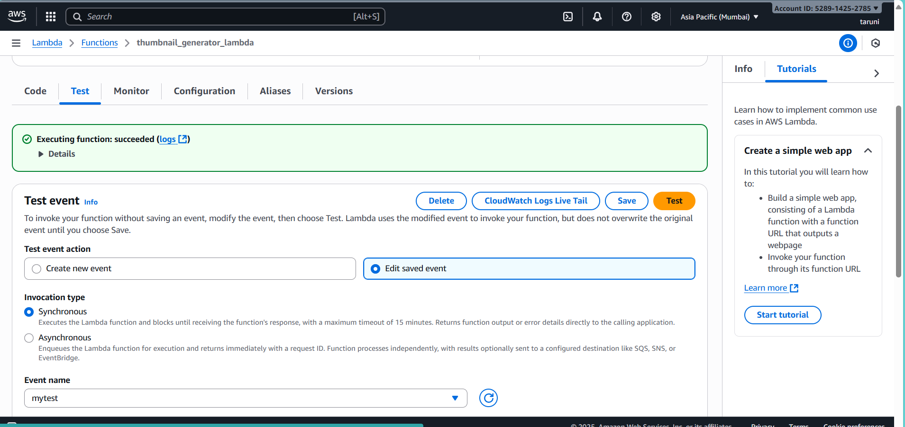
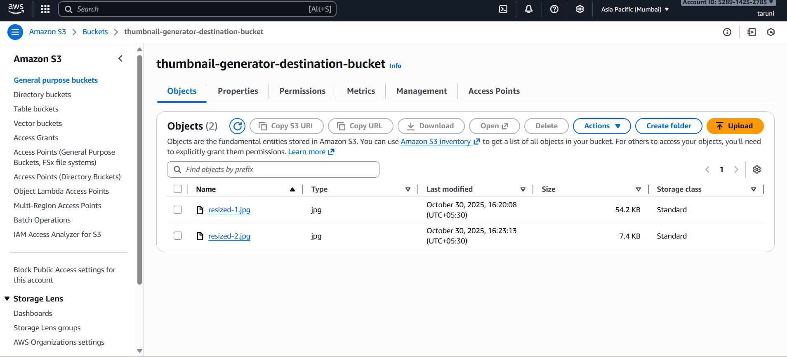

# Create Thumbnail Images with AWS Lambda & S3 Trigger

In this project, we create and configure a Lambda function that resizes images added to an Amazon Simple Storage Service (Amazon S3) bucket. When we add an image file to our bucket, Amazon S3 invokes our Lambda function. The function then creates a thumbnail version of the image and outputs it to a different Amazon S3 bucket.

## Workflow Diagram:


## Prerequisites

- AWS account with permissions to create S3 buckets and Lambda functions using relevant IAM roles and policies.
- AWS CLI installed and configured (optional, you can use AWS Console).
- Python installed locally if creating deployment package manually.
- (Windows users) May need Windows Subsystem for Linux (WSL) to use bash commands like `zip`.


## Step 1: Create Source and Destination S3 Buckets

## Create bucket:

1.Open the Amazon S3 console and select the General purpose buckets page.

2.Select the AWS Region closest to your geographical location. You can change your region using the drop-down list at the top of the screen. Later in the project, you must create your Lambda function in the same Region.

3.Choose Create bucket.

4.Under General configuration, do the following:

   - For Bucket type, ensure General purpose is selected.
   - For Bucket name, enter a globally unique name that meets the Amazon S3 Bucket naming rules. Bucket names can contain only lower case letters, numbers, dots (.), and hyphens (-).
 
5.Leave all other options set to their default values and choose Create bucket.

Repeat steps 1 to 5 to create your destination bucket. For Bucket name, enter amzn-s3-demo-source-bucket-resized, where amzn-s3-source-bucket is the name of the source bucket you just created.

- **Source bucket**: Where you upload original images.
- **Destination bucket**: Where Lambda will store the generated thumbnail images.




## Step 2: Upload a Test Image to the Source Bucket

To upload a test image to your source bucket (console)

1.Open the Buckets page of the Amazon S3 console.

2.Select the source bucket you created in the previous step.

3.Choose Upload.

4.Choose Add files and use the file selector to choose the object you want to upload.

5.Choose Open, then choose Upload.



***

## Step 3: Create a Permission Policy 

Create an IAM policy which grants permission for the Lambda function to:

- Read objects from the source S3 bucket
- Write objects to the destination S3 bucket
- Write logs to CloudWatch Logs

## To create the policy (console)

1.Open the Policies page of the AWS Identity and Access Management (IAM) console.

2.Choose Create policy.

3.Choose the JSON tab, and then paste the following custom policy into the JSON editor.

## Example policy JSON snippet:

```json
{
  "Version": "2012-10-17",
  "Statement": [
    {
      "Effect": "Allow",
      "Action": [
        "logs:PutLogEvents",
        "logs:CreateLogGroup",
        "logs:CreateLogStream"
      ],
      "Resource": "arn:aws:logs:*:*:*"
    },
    {
      "Effect": "Allow",
      "Action": [
        "s3:GetObject",
        "s3:ListBucket"
      ],
      "Resource": [
        "arn:aws:s3:::your-source-bucket-name",
        "arn:aws:s3:::your-source-bucket-name/*"
      ]
    },
    {
      "Effect": "Allow",
      "Action": [
        "s3:PutObject"
      ],
      "Resource": [
        "arn:aws:s3:::your-destination-bucket-name/*"
      ]
    }
  ]
}

```

## Replace your-source-bucket-name and your-destination-bucket-name with your original source and destination bucket names.

4.Choose Next.

5.Under Policy details, for Policy name, enter LambdaS3Policy.

6.Choose Create policy.





## Step 4: Create an Execution Role

An execution role is an IAM role that grants a Lambda function permission to access AWS services and resources. To give your function read and write access to an Amazon S3 bucket, you attach the permissions policy you created in the previous step.

Create an IAM role for Lambda with the above IAM policy attached. This role allows the Lambda function to access the needed AWS resources.

## To create an execution role and attach your permissions policy (console)

1.Open the Roles page of the (IAM) console.

2.Choose Create role.

3.For Trusted entity type, select AWS service, and for Use case, select Lambda.

4.Choose Next.

5.Add the permissions policy you created in the previous step by doing the following:

  - In the policy search box, enter LambdaS3Policy.
  - In the search results, select the check box for LambdaS3Policy.
  - Choose Next.

6.Under Role details, for the Role name enter LambdaS3Role.

7.Choose Create role.



***

## Step 5: Create the Function Deployment Package

To create a function, you create a deployment package containing your function code and its dependencies. For this CreateThumbnail function, your function code uses a separate library for the image resizing.

Package your Lambda function code and dependencies. For example, with Python and Pillow library:

Open AWS Cloudshell

- Create a folder
- Add your Lambda function script `lambda_function.py`
- Install Pillow in this folder 
- Zip all contents into a deployment package `.zip`

 ## Step-by-Step Commands for CloudShell

1. Create working directory and navigate into it
```
- mkdir thumbnail-generator && cd thumbnail-generator

```

2. Create your Lambda function code file

```python
cat <<EOF > lambda_function.py
import boto3
import os
import sys
import uuid
from urllib.parse import unquote_plus
from PIL import Image

s3_client = boto3.client('s3')

def resize_image(image_path, resized_path):
    with Image.open(image_path) as image:
        image.thumbnail(tuple(x / 2 for x in image.size))
        image.save(resized_path)

def lambda_handler(event, context):
    for record in event['Records']:
        bucket = record['s3']['bucket']['name']
        key = unquote_plus(record['s3']['object']['key'])
        tmpkey = key.replace('/', '')
        download_path = '/tmp/{}{}'.format(uuid.uuid4(), tmpkey)
        upload_path = '/tmp/resized-{}'.format(tmpkey)

        s3_client.download_file(bucket, key, download_path)
        resize_image(download_path, upload_path)
        s3_client.upload_file(
            upload_path,
            '{}-resized'.format(bucket),
            'resized-{}'.format(key)
        )
EOF
```
3.Create a directory for dependencies
```
mkdir package
```

4.Install dependencies into the package directory
```
pip install \
--platform manylinux2014_x86_64 \
--target=package \
--implementation cp \
--python-version 3.12 \
--only-binary=:all: --upgrade \
pillow boto3
```

5.Zip the dependencies
```
cd package
zip -r ../lambda_function.zip .
cd ..
```

6.Add your Lambda function code to the zip
```
zip lambda_function.zip lambda_function.py
```

7.Upload the zip file to your S3 source bucket
```
aws s3 cp lambda_function.zip s3://your-source-bucket-name/
```




## Step 6: Create the Lambda Function

Create the Lambda function using AWS Console:

1.Open the Functions page of the Lambda console.

2.Make sure you're working in the same AWS Region you created your Amazon S3 bucket in. You can change your region using the drop-down list at the top of the screen.

3.Choose Create function.

4.Choose Author from scratch.

5.Under Basic information, do the following:

- For Function name, enter CreateThumbnail.

- For Runtime, choose Python 3.12 .

- For Architecture, choose x86_64.

6.In the Change default execution role tab, do the following:

- Expand the tab, then choose Use an existing role.

- Select the LambdaS3Role you created earlier.

7.Choose Create function.

## To upload the function code (console)

1.In the Code source pane, choose Upload from.

2.Choose from S3 bucket.

3.Copy object URL of the zip file and paste it.

4.Click save.



***

## Step 7: Configure Amazon S3 to Invoke the Lambda Function

For your Lambda function to run when you upload an image to your source bucket, you need to configure a trigger for your function.

## To configure the Amazon S3 trigger (console)

1.Open the Functions page of the Lambda console and choose your function (CreateThumbnail).

2.Choose Add trigger.

3.Select S3.

4.Under Bucket, select your source bucket.

5.Under Event types, select All object create events.

6.Under Recursive invocation, select the check box to acknowledge that using the same Amazon S3 bucket for input and output is not recommended. 

7.Choose Add.

When you create a trigger using the Lambda console, Lambda automatically creates a resource based policy to give the service you select permission to invoke your function.

***

## Step 8: Test Lambda Function with a Dummy Event

1.Open the Functions page of the Lambda console and choose your function (CreateThumbnail).

2.Choose the Test tab.

3.To create your test event, in the Test event pane, do the following:

a. Under Test event action, select Create new event.

b. For Event name, enter myTestEvent.

c. Replace the values for the following parameters with your own values.

- For awsRegion, replace us-east-1 with the AWS Region you created your Amazon S3 buckets in.

- For name, replace your-source-bucket-name with the name of your own Amazon S3 source bucket.

- For key, replace test%2Fkey with the filename of the test object you uploaded to your source bucket in the step Upload a test image to your source bucket.


```
{
  "Records": [
    {
      "eventVersion": "2.0",
      "eventSource": "aws:s3",
      "awsRegion": "ap-south-1",
      "eventTime": "1970-01-01T00:00:00.000Z",
      "eventName": "ObjectCreated:Put",
      "userIdentity": {
        "principalId": "EXAMPLE"
      },
      "requestParameters": {
        "sourceIPAddress": "127.0.0.1"
      },
      "responseElements": {},
      "s3": {
        "s3SchemaVersion": "1.0",
        "configurationId": "testConfigRule",
        "bucket": {
          "name": "your-source-bucket-name",
          "ownerIdentity": {
            "principalId": "EXAMPLE"
          },
          "arn": "arn:aws:s3:::your-source-bucket-name"
        },
        "object": {
          "key": "test%2Fkey",
          "eTag": "0123456789abcdef0123456789abcdef"
        }
      }
    }
  ]
}

```

- Choose save
  
4.In the Test event pane, choose Test.

5.To check the your function has created a resized verison of your image and stored it in your target Amazon S3 bucket, do the following:

- Open the Buckets page of the Amazon S3 console.

- Choose your target bucket and confirm that your resized file is listed in the Objects pane.

***

## Step 9: Test Your Function Using the Amazon S3 Trigger

Upload a new image file to the source bucket. Verify the Lambda function is triggered and a thumbnail image is created in the destination bucket.



***

## Step 10: Clean Up Resources

You can now delete the resources that you created for this project, unless you want to retain them. By deleting AWS resources that you're no longer using, you prevent unnecessary charges to your AWS account.

## To delete the Lambda function

1.Open the Functions page of the Lambda console.

2.Select the function that you created.

3.Choose Actions, Delete.

4.Type confirm in the text input field and choose Delete.

## To delete the policy that you created

1.Open the Policies page of the IAM console.

2.Select the policy that you created (AWSLambdaS3Policy).

3.Choose Policy actions, Delete.

4.Choose Delete.

## To delete the execution role

1.Open the Roles page of the IAM console.

2.Select the execution role that you created.

3.Choose Delete.

4.Enter the name of the role in the text input field and choose Delete.

## To delete the S3 bucket

1.Open the Amazon S3 console.

2.Select the bucket you created.

3.Choose Delete.

4.Enter the name of the bucket in the text input field.

5.Choose Delete bucket.

 ## Commands required:

$ terraform init

$ terraform plan

$ terraform apply

$ terraform destroy

AWS CLI Commands $ aws iam list-policies --query 'Policies[?PolicyName == thumbnail_s3_policy]'

$ aws iam list-roles --query 'Roles[?RoleName == thumbnail_lambda_role]'

$ aws lambda list-functions --query 'Functions[?FunctionName == thumbnail_generation_lambda]'

$ aws s3 ls | grep cp-

$ aws s3 ls s3://cp-original-image-bucket

$ aws s3 ls s3://cp-thumbnail-image-bucket

$ aws logs describe-log-groups --query 'logGroups[?logGroupName == /aws/lambda/thumbnail_generation_lambda]'

$ aws logs tail /aws/lambda/thumbnail_generation_lambda

$ aws s3 cp high_resolution_image.jpeg s3://cp-original-image-bucket

$ aws logs tail /aws/lambda/thumbnail_generation_lambda

$ aws s3 ls s3://cp-original-image-bucket

$ aws s3 ls s3://cp-thumbnail-image-bucket

