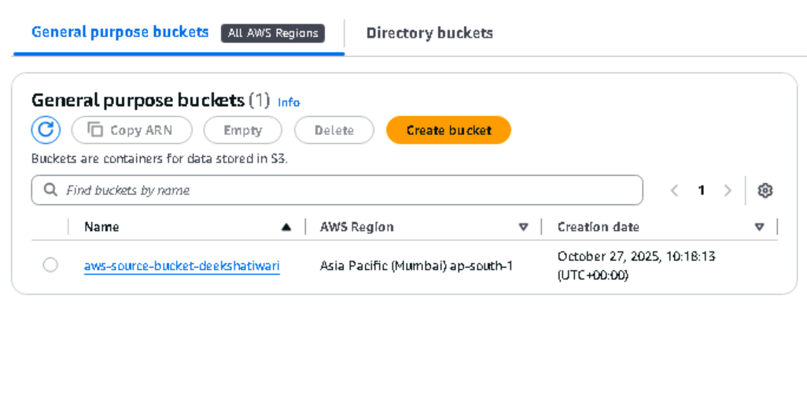
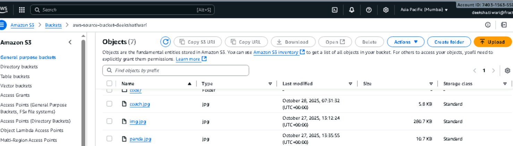
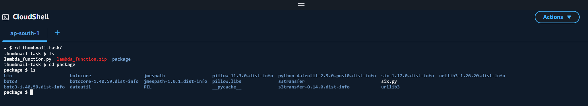
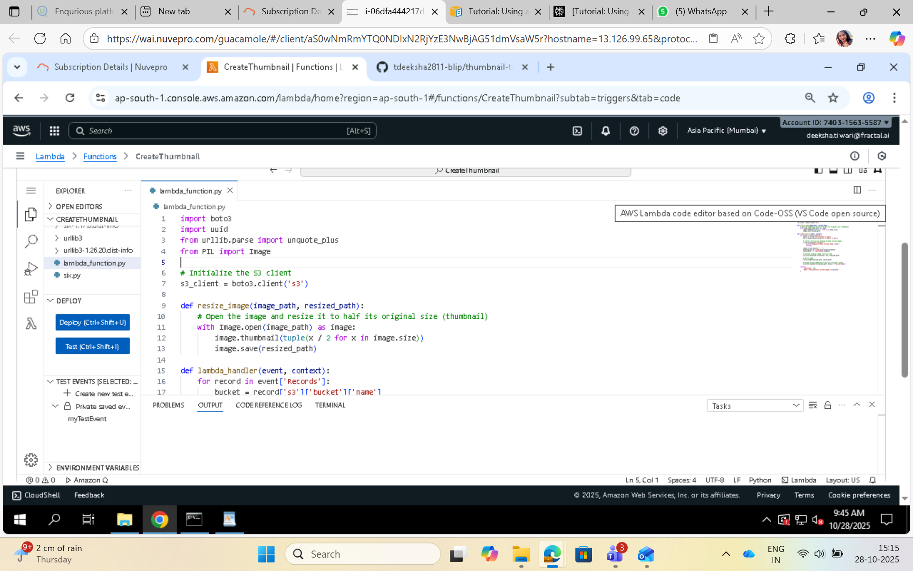
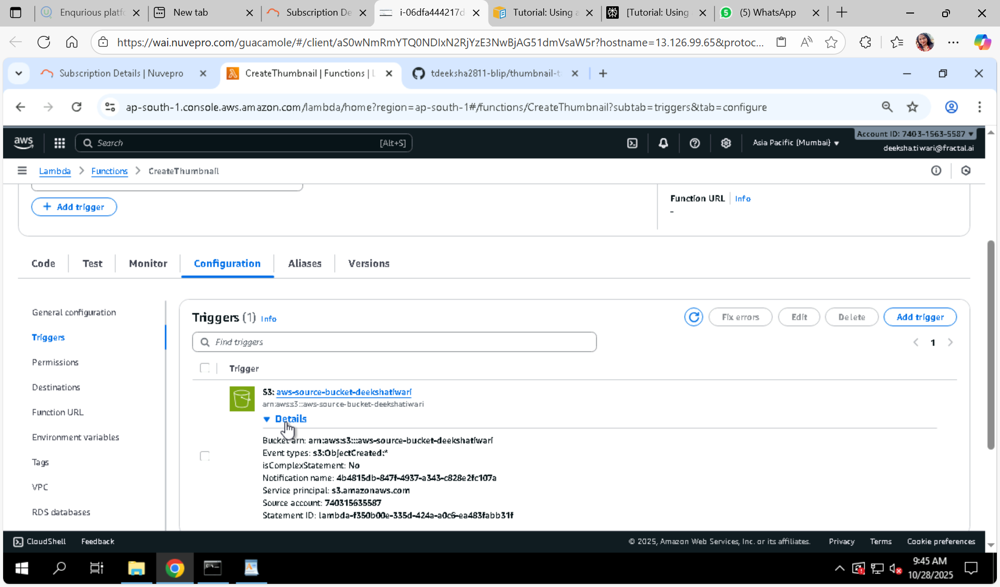
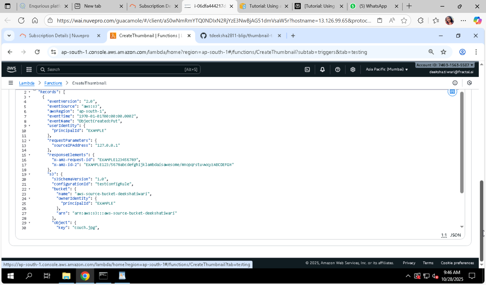
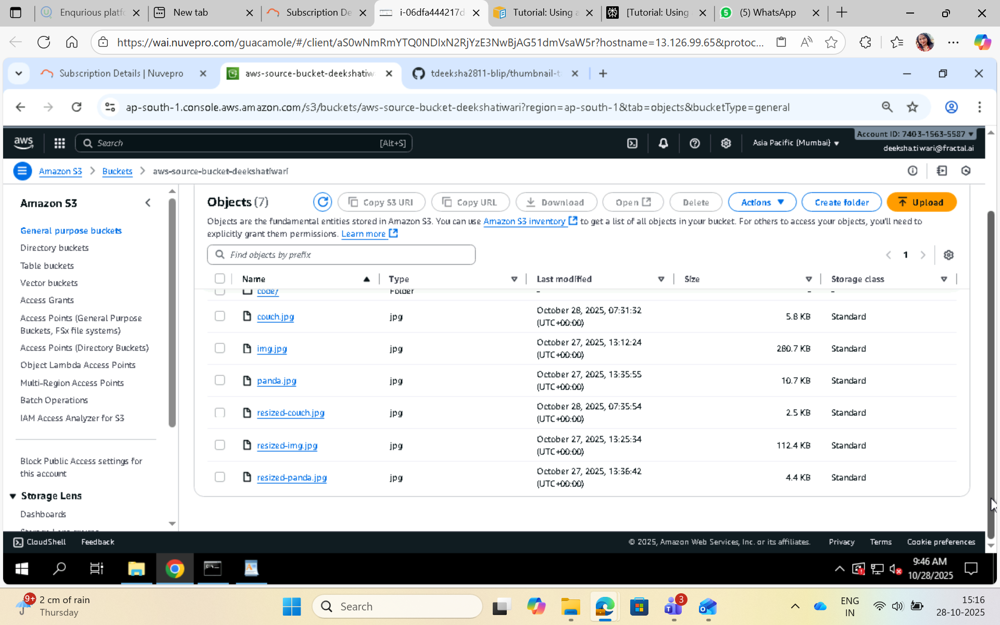

# Create Thumbnail Images with AWS Lambda & S3 Trigger

In this project, we create and configure a Lambda function that resizes images added to an Amazon Simple Storage Service (Amazon S3) bucket. When we add an image file to our bucket, Amazon S3 invokes our Lambda function. The function then creates a thumbnail version of the image and outputs it to a different Amazon S3 bucket.

## Workflow Diagram:


## Prerequisites

- AWS account with permissions to create S3 buckets and Lambda functions using relevant IAM roles and policies.
- AWS CLI installed and configured (optional, you can use AWS Console).
- Python or Node.js installed locally if creating deployment package manually.
- (Windows users) May need Windows Subsystem for Linux (WSL) to use bash commands like `zip`.


## Step 1: Create Source and Destination S3 Buckets

## Create bucket:

1.Open the Amazon S3 console and select the General purpose buckets page.

2.Select the AWS Region closest to your geographical location. You can change your region using the drop-down list at the top of the screen. Later in the project, we must create our Lambda function in the same Region.

3.Choose Create bucket.

4.Under General configuration, do the following:

   - For Bucket type, ensure General purpose is selected.
 
   - For Bucket name, enter a globally unique name that meets the Amazon S3 Bucket naming rules. Bucket names can contain only lower case letters, numbers, dots (.), and hyphens (-).
 
5.Leave all other options set to their default values and choose Create bucket.

Repeat steps 1 to 5 to create your destination bucket. For Bucket name, enter amzn-s3-demo-source-bucket-resized, where amzn-s3-source-bucket is the name of the source bucket you just created.

- **Source bucket**: Where you upload original images.
- **Destination bucket**: Where Lambda will store the generated thumbnail images.




## Step 2: Upload a Test Image to the Source Bucket

To upload a test image to your source bucket (console)

1.Open the Buckets page of the Amazon S3 console.

2.Select the source bucket you created in the previous step.

3.Choose Upload.

4.Choose Add files and use the file selector to choose the object you want to upload.

5.Choose Open, then choose Upload.



***

## Step 3: Create a Permission Policy 

Create an IAM policy which grants permission for the Lambda function to:

- Read objects from the source S3 bucket
- Write objects to the destination S3 bucket
- Write logs to CloudWatch Logs

## To create the policy (console)

1.Open the Policies page of the AWS Identity and Access Management (IAM) console.

2.Choose Create policy.

3.Choose the JSON tab, and then paste the following custom policy into the JSON editor.

## Example policy JSON snippet:

```json
{
  "Version": "2012-10-17",
  "Statement": [
    {
      "Effect": "Allow",
      "Action": [
        "logs:PutLogEvents",
        "logs:CreateLogGroup",
        "logs:CreateLogStream"
      ],
      "Resource": "arn:aws:logs:*:*:*"
    },
    {
      "Effect": "Allow",
      "Action": [
        "s3:GetObject",
        "s3:ListBucket"
      ],
      "Resource": [
        "arn:aws:s3:::your-source-bucket-name",
        "arn:aws:s3:::your-source-bucket-name/*"
      ]
    },
    {
      "Effect": "Allow",
      "Action": [
        "s3:PutObject"
      ],
      "Resource": [
        "arn:aws:s3:::your-destination-bucket-name/*"
      ]
    }
  ]
}

```

## Replace your-source-bucket-name and your-destination-bucket-name with your original source and destination bucket names.

4.Choose Next.

5.Under Policy details, for Policy name, enter LambdaS3Policy.

6.Choose Create policy.


## Step 4: Create an Execution Role

An execution role is an IAM role that grants a Lambda function permission to access AWS services and resources. To give your function read and write access to an Amazon S3 bucket, you attach the permissions policy you created in the previous step.

Create an IAM role for Lambda with the above IAM policy attached. This role allows the Lambda function to access the needed AWS resources.

## To create an execution role and attach your permissions policy (console)

1.Open the Roles page of the (IAM) console.

2.Choose Create role.

3.For Trusted entity type, select AWS service, and for Use case, select Lambda.

4.Choose Next.

5.Add the permissions policy you created in the previous step by doing the following:

  - In the policy search box, enter LambdaS3Policy.
  - In the search results, select the check box for LambdaS3Policy.
  - Choose Next.

6.Under Role details, for the Role name enter LambdaS3Role.

7.Choose Create role.


***

## Step 5: Create the Function Deployment Package

To create a function, you create a deployment package containing your function code and its dependencies. For this CreateThumbnail function, your function code uses a separate library for the image resizing.

Package your Lambda function code and dependencies. For example, with Python and Pillow library:

- Create a folder
- Add your Lambda function script `lambda_function.py`
- Install Pillow in this folder (e.g., `pip install Pillow -t .`)
- Zip all contents into a deployment package `.zip`



## Step 6: Create the Lambda Function

Create the Lambda function using AWS Console or CLI:

- Choose runtime (Python or Node.js)
- Assign the execution role created earlier
- Upload the deployment package
 
 


***

## Step 7: Configure Amazon S3 to Invoke the Lambda Function

Add an S3 trigger to the Lambda function for the source bucket, configured to run on object-created events (upload).

**Important:** Configure trigger only on the source bucket to avoid infinite invocation loops.

***

## Step 8: Test Lambda Function with a Dummy Event

Invoke the Lambda function manually with a sample event to confirm it responds correctly.

***

## Step 9: Test Your Function Using the Amazon S3 Trigger

Upload a new image file to the source bucket. Verify the Lambda function is triggered and a thumbnail is created in the destination bucket.



***

## Step 10: Clean Up Resources

To avoid charges, delete:

- Lambda function
- IAM policy and role created
- S3 buckets created (empty first if required)


# Additional Notes

- Ensure triggers are carefully configured only on the source bucket.
- Monitor function logs in CloudWatch for debugging and verification.
- This setup can be extended for other automatic image processing tasks.

(if you are working on windows and tried creating zip files manually and it is saying lambda_function.py or module not found error showing then 
try creating all files packages , and zip files on aws cli and upload it to code folder inside s3 bucket then in lambda function go to >> upload from >> aws location >> s3 bucket name >> code/ >>lambda_function.zip )


 ## Commands required:

$ terraform init

$ terraform plan

$ terraform apply

$ terraform destroy

AWS CLI Commands $ aws iam list-policies --query 'Policies[?PolicyName == thumbnail_s3_policy]'

$ aws iam list-roles --query 'Roles[?RoleName == thumbnail_lambda_role]'

$ aws lambda list-functions --query 'Functions[?FunctionName == thumbnail_generation_lambda]'

$ aws s3 ls | grep cp-

$ aws s3 ls s3://cp-original-image-bucket

$ aws s3 ls s3://cp-thumbnail-image-bucket

$ aws logs describe-log-groups --query 'logGroups[?logGroupName == /aws/lambda/thumbnail_generation_lambda]'

$ aws logs tail /aws/lambda/thumbnail_generation_lambda

$ aws s3 cp high_resolution_image.jpeg s3://cp-original-image-bucket

$ aws logs tail /aws/lambda/thumbnail_generation_lambda

$ aws s3 ls s3://cp-original-image-bucket

$ aws s3 ls s3://cp-thumbnail-image-bucket

