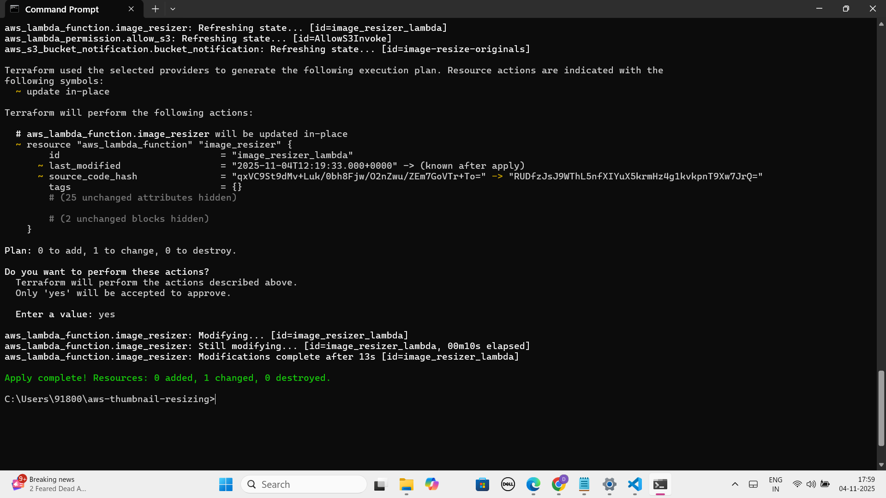
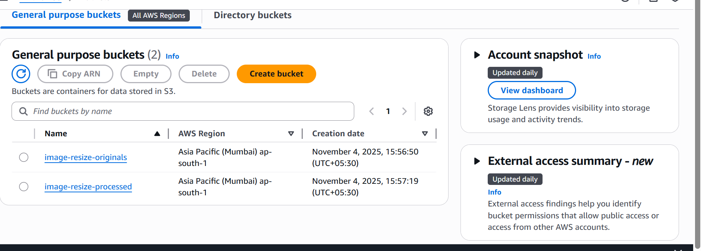
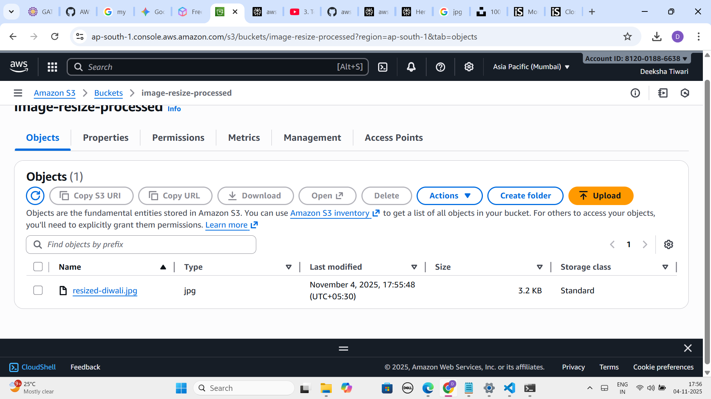
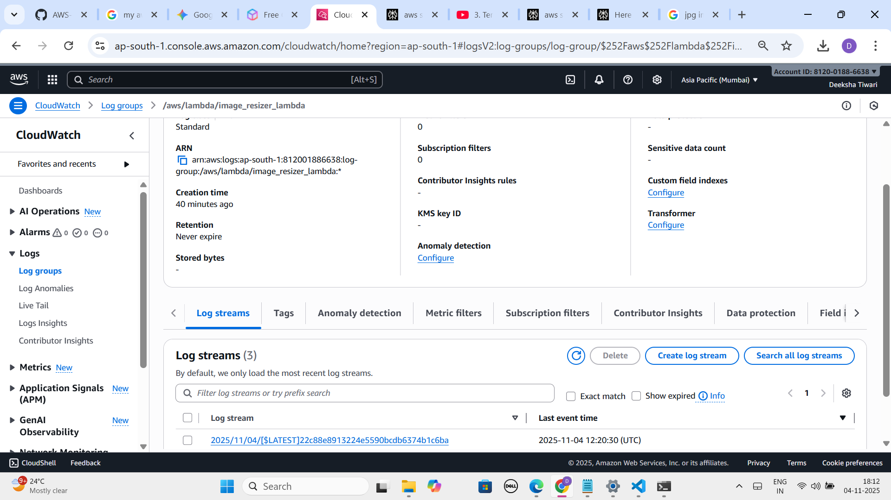

## Project: AWS S3 Image Resizing Pipeline using Terraform and Lambda

### Summary
This project automates image resizing using AWS S3, Lambda, and Terraform. When an image is uploaded to the source bucket (`image-resize-originals`), a Lambda function triggers, resizes the image to 100x100 pixels, and stores it in the destination bucket (`image-resize-processed`).

### Architecture Overview
- S3 buckets: `image-resize-originals` (source), `image-resize-processed` (target)
- Lambda function executed on S3 upload event to resize images.
- IAM roles and policies configured for Lambda access.
- Terraform used for infrastructure provisioning.

### Setup and Execution Steps
1. **Terraform applied to provision resources:**
   - Created S3 buckets.
   - Created IAM roles & policies.
   - Created Lambda function with permissions.
   - Set S3 event notification to trigger Lambda.

2. **Lambda function ZIP packaged and uploaded to S3.**

3. **Lambda function updated from S3 ZIP location.**

4. **Testing by uploading an image to source bucket.**

***

### Screenshots Proof:

1. **Terraform apply output:**  

   


2. **S3 Buckets in AWS Console:**  

   

3. **Lambda Function Console:**  

   


5. **Test Upload Triggers Lambda:**  

   1[test image](pictures/source%20bucket%20file.png)

6. **Resized Image in Destination Bucket:**  

   

7. **CloudWatch Logs Showing Lambda Execution:**  

   

***

### How to Run

- Initialize and apply Terraform:
  ```bash
  terraform init
  terraform apply
  ```

- Package Lambda:
  ```bash
  pip install pillow -t package/
  cp lambda_function.py package/
  cd package
  zip -r ../lambda_function.zip .
  cd ..
  aws s3 cp lambda_function.zip s3://image-resize-originals/lambda-deployments/
  ```

- Update Lambda from S3 ZIP:
  ```bash
  aws lambda update-function-code --function-name image_resizer_lambda --s3-bucket image-resize-originals --s3-key lambda-deployments/lambda_function.zip
  ```

- Test by uploading images to the `image-resize-originals` bucket.

